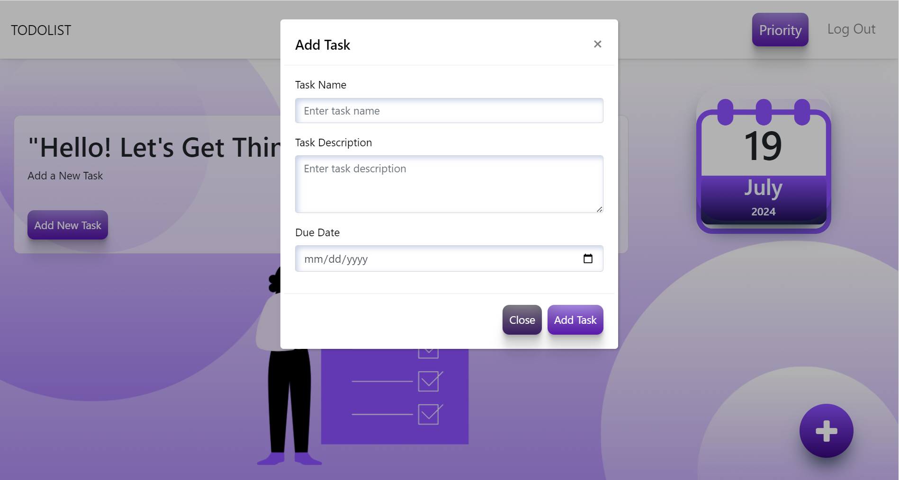

# 📝 To-Do List Application

Welcome to the To-Do List Application! This project is designed to help you keep track of your tasks and stay organized. Whether you're managing personal errands, work projects, or anything in between, this application is here to make your life easier.

## 🚀 Features

- **Add Tasks**: Quickly add new tasks to your list.
- **Edit Tasks**: Modify existing tasks to keep your list up to date.
- **Delete Tasks**: Remove tasks that are no longer needed.
- **Mark as Complete**: Check off tasks as you complete them.
- **Due Dates**: Assign due dates to tasks to keep track of deadlines.
- **Prioritize Tasks**: Easily prioritize tasks to focus on what's most important.
- **User-Friendly Interface**: Designed with a clean and intuitive UI for a seamless experience.

## 🛠️ Technologies Used

- **Frontend**: HTML, CSS, Bootstrap, JavaScript

## 📸 Screenshots

### Main Interface

### Adding a Task

### Task List

## ✨ Acknowledgements

- Thanks to the open-source community for their invaluable resources.

---

Happy task managing! 😊
